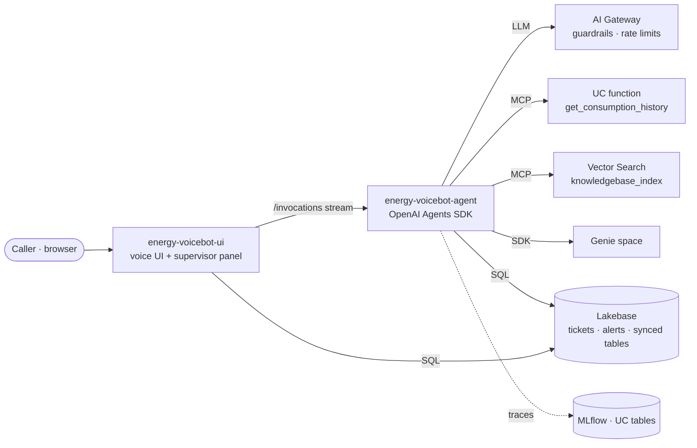

# ENERGY Voicebot — Sofia

A voice customer-service agent for an energy utility, built end-to-end on Databricks. Sofia answers
billing and policy questions, explains consumption, opens installment plans, records meter readings
and alerts an on-call supervisor when a caller is distressed — by voice, in English, grounded in a
knowledge base.

ENERGY is a fictional supplier: the knowledge base (30 articles) and the customer data are synthetic,
and every price or delay in them is illustrative.

| Capability | Where it shows up |
|---|---|
| **Databricks Apps** | two apps — the agent and the voice UI — deployed from one bundle ([databricks.yml](databricks.yml)) |
| **Agent framework** | OpenAI Agents SDK served by MLflow AgentServer ([apps/agent/agent.py](apps/agent/agent.py)) |
| **AI Gateway** | every agent LLM call goes through a gateway service: guardrails, rate limits, usage tracking ([setup/competitor_guardrail.md](setup/competitor_guardrail.md)) |
| **Managed MCP servers** | a UC function and a Vector Search index are exposed to the agent as MCP tools, with no glue code |
| **Unity Catalog governance** | each app's service principal gets exactly the grants declared in its bundle `resources` |
| **AI Search** (formerly Vector Search) | delta-sync index over the knowledge base |
| **Genie** | natural-language questions over the caller's invoices (`ask_genie`, Databricks SDK) |
| **Lakebase** | Postgres OLTP for write-backs (tickets, supervisor alerts) and synced tables for fast lookups |
| **MLflow 3** | tracing to Unity Catalog tables, `mlflow.genai.evaluate()` |

---

## Architecture



The UI relays the agent's token stream to the browser. When a caller is distressed, the agent's
`notify_oncall` tool writes an alert to Lakebase, and the UI's supervisor panel shows it live.

## Repository

```
databricks.yml             the bundle: variables, the `dev` target, the two apps and their grants
apps/
  agent/                   agent.py (model + tools + agent + serving) · prompt.py · tools.py · databricks_helpers.py
  ui/                      server.py (stream relay, suggestions, alerts) · static/index.html (voice UI)
setup/
  01_build_data_assets     notebook: data, knowledge base, Vector Search, Lakebase, MLflow, Genie
  02_grant_app_access      notebook: grants for the deployed apps
  99_teardown              notebook: delete what 01 created
  voicebot_setup.py        the setup steps used by the notebooks · bundle_config.py reads databricks.yml
  competitor_guardrail.md  AI Gateway guardrails for the demo
  data/                    synthetic knowledge base and evaluation questions
eval/
  evaluate_agent           notebook: mlflow.genai.evaluate() on the agent
```

---

## Install from the Databricks UI

### Prerequisites

- A workspace with Unity Catalog, serverless compute, Databricks Apps, Lakebase, AI Search (formerly
  Vector Search) and Foundation Model APIs (`databricks-qwen3-embedding-0-6b` for embeddings, `databricks-gpt-5-4-mini` for the UI's
  suggestions and the eval judges)
- AI Gateway with service policies (beta: an account admin enables it from the account console **Previews** page)
- A catalog where you can create a schema, and a SQL warehouse you can use
- Permission to create apps, a Lakebase project and an AI Search endpoint

### 1. Clone the repo into a Git folder

**Workspace** → your home folder → **Create** → **Git folder** → paste the URL of this repository →
**Create Git folder**.

### 2. Set the catalog and the warehouse

Open `databricks.yml` in the Git folder. In `targets` → `dev` → `variables`, replace `<catalog>` and
`<warehouse-id>` (the ID is shown next to the warehouse's name in **SQL Warehouses**).

### 3. Build the data assets

Open the notebook `setup/01_build_data_assets`, attach **serverless** compute and click **Run all**.
The first run takes about 15 minutes. It creates the schema `energy_voicebot` with generated customers,
invoices and consumption, the knowledge base and its Vector Search index, the AI Gateway model service
`<catalog>.energy_voicebot.energy_voicebot_gateway` (routing to `databricks-gpt-5-4-mini`), the Lakebase
project and tables, the MLflow experiment and the Genie space — and prints `genie_space_id` and
`experiment_id`.

To use another model, set `gateway_model` in the `dev` target before running it. To use an AI Gateway
service you already have, set `llm_endpoint` to its full name: the notebook then leaves it as it is.

### 4. Finish `databricks.yml`

In the `dev` target, paste the `genie_space_id` and `experiment_id` printed in step 3.

### 5. Deploy the bundle

With `databricks.yml` open, click the **deployments** icon, choose the target **dev** and click
**Deploy**, then **Deploy** again in the confirmation dialog. Progress shows in **Project output**.

### 6. Start the apps

In the **Bundle resources** pane, click the run icon next to `energy_voicebot_agent`, then next to
`energy_voicebot_ui`. Each run uploads the app's code and starts it.

### 7. Grant the apps access

Open `setup/02_grant_app_access`, attach **serverless** compute and click **Run all**. It also grants
the agent `EXECUTE` on the AI Gateway service; if you don't manage that service, the notebook prints the
grant to ask its owner for.

### 8. Try it

**Compute** → **Apps** → `energy-voicebot-ui` → open its URL in Chrome. Pick a caller and a scenario, or
tap the mic. Click **Supervisor** to see the on-call alerts (try the **Angry escalation** scenario).

### Optional

- **Guardrails**: attach the competitor LLM-as-a-judge policy and the built-in ones —
  [setup/competitor_guardrail.md](setup/competitor_guardrail.md).
- **Evaluation**: run `eval/evaluate_agent` (see [Observability and evaluation](#observability-and-evaluation)).
- **Updates**: pull the Git folder, then repeat steps 5 and 6.
- **Clean up**: delete both apps in **Compute** → **Apps**, then run `setup/99_teardown`.

### With the Databricks CLI instead

The setup notebooks still run in the workspace; the deploy steps 5 and 6 become:

```bash
databricks bundle deploy -t dev -p <profile>
databricks bundle run energy_voicebot_agent -t dev -p <profile>
databricks bundle run energy_voicebot_ui    -t dev -p <profile>
```

---

## The agent

An agent is a model, instructions and tools. [apps/agent/agent.py](apps/agent/agent.py) assembles them:

| File | What it holds |
|---|---|
| [agent.py](apps/agent/agent.py) | the model (AI Gateway), the tool lists, the `Agent`, the streaming endpoint |
| [prompt.py](apps/agent/prompt.py) | Sofia's instructions, including when to use each tool |
| [tools.py](apps/agent/tools.py) | Python tools (`@function_tool`) |
| [databricks_helpers.py](apps/agent/databricks_helpers.py) | plumbing: AI Gateway client, managed MCP servers, auth |

### Adding a tool

1. **Python function** — write it in `tools.py` with `@function_tool` (name, type hints and docstring
   become the tool schema) and add it to `PYTHON_TOOLS` in `agent.py`.
2. **Databricks managed MCP server** — add one line to `mcp_servers()` in `agent.py`: UC functions of a
   schema, Vector Search indexes of a schema, a Genie space or an external MCP connection become tools.
3. Tell the model when to use it in `prompt.py`, and grant the app access to what it touches in
   `databricks.yml` (`resources` of `energy_voicebot_agent`).

`tools.py` ends with a disabled example: web search through an external MCP server (You.com) registered
as a Unity Catalog connection, with the steps to turn it on.

Sofia's tools:

| Tool | Served by | Purpose |
|---|---|---|
| `knowledgebase_index` | Vector Search managed MCP | policy / how-to / cost answers from the knowledge base |
| `get_consumption_history` | UC functions managed MCP | monthly usage + temperature to explain a bill |
| `get_customer_summary` | Python tool · Lakebase synced tables | profile + open invoices |
| `create_installment_plan` | Python tool · Lakebase | writes a ticket, returns its id |
| `submit_meter_reading` | Python tool · Lakebase | writes a ticket, returns its id |
| `get_account_activity` | Python tool · Lakebase | reads the caller's recent tickets |
| `notify_oncall` | Python tool · Lakebase | writes a supervisor alert, shown live in the UI |
| `ask_genie` | Python tool · Genie (SDK) | open-ended questions about the caller's own invoices |

Each turn runs at most 4 LLM rounds, streams text token by token, and emits every tool call and result
as Responses-API items, which the UI shows as chips and replays on the next turn. If the AI Gateway blocks a
request, the agent answers with a polite refusal and tags the trace `guardrail_block`. Rate limits or
model errors lead to a hand-off to a human agent.

## Observability and evaluation

`mlflow.openai.autolog()` traces every run: the agent span, each LLM call and each tool call. Traces are
stored in Unity Catalog tables (`energy_voicebot.voicebot_traces_otel_*`) of the experiment created in step 3.

The notebook `eval/evaluate_agent` runs the agent in-process and scores it with `mlflow.genai.evaluate()`:
on the 16 questions of `setup/data/eval_questions.json` (dataset **curated**), or on the app's real traffic
from the last hours (dataset **traces**). Scorers: `relevance_to_query` and `safety` (LLM judges), and
`is_concise` (the 2-4 sentence voice constraint).

## Local development

```bash
cd apps/agent && pip install -r requirements.txt
export DATABRICKS_CONFIG_PROFILE=<profile>
export ENERGY_CATALOG=<catalog> ENERGY_LLM_ENDPOINT=<catalog>.energy_voicebot.energy_voicebot_gateway \
       ENERGY_GENIE_SPACE_ID=<id> \
       ENERGY_LAKEBASE_ENDPOINT=projects/energy-voicebot-oltp/branches/production/endpoints/primary \
       PGHOST=<lakebase-host> MLFLOW_TRACKING_URI=databricks MLFLOW_EXPERIMENT_ID=<id>
python start_server.py --port 8000

cd apps/ui && AGENT_URL=http://localhost:8000 uvicorn server:app --port 8001   # voice UI
```

## License

Released under the [Databricks License](LICENSE).
